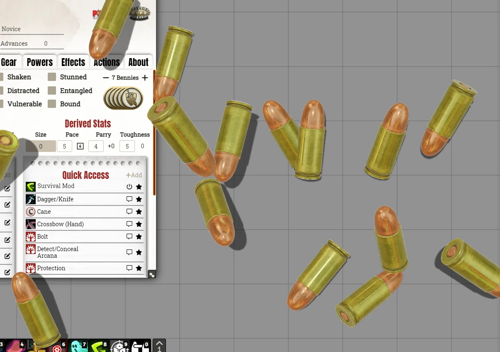

# SWADE - More Bennies
This module add new bennies models for **SWADE**.

## Bennies
**CLICK THE IMAGE TO WATCH THE VIDEO**

## Features
- Pick new 3D models for you bennies.
- Each player can pick their favorite.

# Instalation
You can install this module with this link: https://raw.githubusercontent.com/brunocalado/swade-more-bennies/main/module.json

# How To
- Activated the module. 
- Go to Dice so Nice settings, click the bene (db) and pick one option.

  

# Acknowledges
- @JDW#6422 

# Changes
You can see changes at [CHANGELOG](CHANGELOG.md).

# License
[LICENSE](LICENSE.md)

# Assets License
[LICENSE](LICENSE-ASSETS.md)